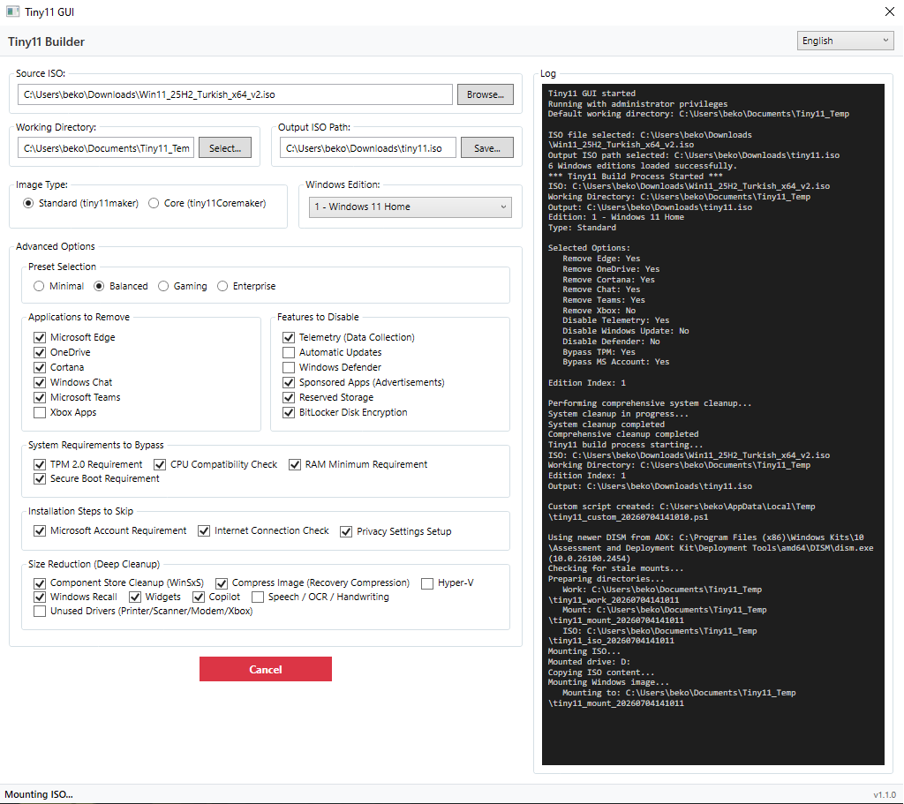

<div align="center">
  
  <h1>Tiny11 GUI</h1>
  <p>A guided Windows desktop app for building a configurable, lighter Windows 11 installation image.</p>
  <p>
    <a href="https://github.com/brk4lp/Tiny11-GUI/actions/workflows/ci.yml"></a>
    <a href="https://github.com/brk4lp/Tiny11-GUI/releases"></a>
    <a href="https://github.com/brk4lp/Tiny11-GUI/releases"></a>
    
    
  </p>
  <p><a href="https://github.com/brk4lp/Tiny11-GUI/releases">Download</a> · <a href="#quick-start">Quick start</a> · <a href="ROADMAP.md">Roadmap</a> · <a href="CONTRIBUTING.md">Contribute</a></p>
</div>

Tiny11 GUI is inspired by [tiny11builder](https://github.com/ntdevlabs/tiny11builder). It turns your own Windows 11 ISO into a customized image through a WPF interface and a generated, fail-fast PowerShell/DISM workflow. It does **not** distribute Windows media or product keys.

## Features

- Build from WIM- or ESD-based Windows 11 media with edition selection
- Removable apps: Edge, OneDrive, Cortana, Chat, Teams, Xbox
- Disable telemetry, Windows Update, Defender, sponsored apps, reserved storage, BitLocker
- Size reduction: DISM component store cleanup, recovery compression of `install.wim`, Hyper-V/Recall/Speech/OCR/Handwriting stripping, driver store cleanup
- Bypass TPM/CPU/RAM/Secure Boot checks and MS account/network/privacy setup steps
- Built-in presets: Minimal, Balanced, Gaming, Enterprise
- Live log output during the build
- UI languages: English, Turkish, Russian, Japanese, German, French, Spanish, and Simplified Chinese
- Ownership-based recovery that avoids terminating unrelated PowerShell processes or discarding unrelated mounted images
- Atomic output publishing, so a failed build cannot overwrite a known-good ISO or report an old file as success

## Quick start

1. Download the latest portable ZIP from [Releases](https://github.com/brk4lp/Tiny11-GUI/releases) and extract it.
2. Install the Windows ADK **Deployment Tools** component, which provides `oscdimg.exe`.
3. Run `tiny11-ui.exe` as administrator.
4. Select a Windows 11 ISO, edition, working directory, output path, and preset.
5. Review the selected options, start the build, and follow the live log.

> [!IMPORTANT]
> Removing system components or disabling security/update features can reduce compatibility, serviceability, and security.

## Works on debloated Windows too

The app doesn't depend on the Storage Management WMI provider (`Get-Volume`/`Get-Disk`/`Get-Partition`), which is commonly missing or broken on trimmed-down Windows installs (Tiny10/Tiny11-style builds). ISO mounting is detected with a plain drive-letter diff instead, and DISM operations use the newest `dism.exe` available on the machine (preferring Windows ADK's if it's newer than the one bundled with the OS) rather than assuming the host's DISM can service whatever image you're building. So building — or testing — this tool from an already-debloated system should work fine.

## Requirements and compatibility

- Windows 10/11
- 64-bit Windows 10 or Windows 11 host
- .NET 8 Desktop Runtime when using a framework-dependent build; release ZIPs are self-contained
- Administrator privileges (required for WIM mount/unmount)
- Windows ADK Deployment Tools — required for `oscdimg.exe`
- A Windows 11 ISO and sufficient free disk space in the working directory

## Building from Source

```bash
git clone https://github.com/brk4lp/Tiny11-GUI.git
```

Open `tiny11-ui.sln` in Visual Studio and build (`Ctrl+Shift+B`).

From the command line:

```powershell
dotnet restore tiny11-ui.sln --configfile NuGet.config
dotnet build tiny11-ui.sln --configuration Release --no-restore
dotnet test tests/Tiny11UI.Tests/Tiny11UI.Tests.csproj --configuration Release --no-build --no-restore
```

## Usage

1. Run the app **as administrator**
2. Select your Windows 11 ISO and choose the edition
3. Set the output ISO path
4. Pick a preset or configure removal/bypass options manually
5. Click "Start Build Tiny11" and watch progress in the log panel

## How It Works

Based on your selections, the app generates and runs a PowerShell script. It mounts the source ISO, services the selected offline Windows image with DISM, applies the chosen configuration, commits the image, and creates a bootable ISO with ADK's `oscdimg.exe`.

Critical native commands are checked explicitly. Each build records the resources it owns, cleans only those resources after failure or cancellation, and writes the final ISO to a unique temporary file before atomically publishing it to the requested destination.

## Project status

Tiny11 GUI is beta software. The generated PowerShell syntax and core safety invariants are covered by automated tests, but Windows image combinations vary widely. Reports that include the host build, source ISO build/language/edition, WIM versus ESD, selected options, and sanitized logs are especially useful.

## Testing & Feedback

Found a reproducible problem? Use the structured [bug report](https://github.com/brk4lp/Tiny11-GUI/issues/new/choose). Have an idea or compatibility result? Start a [Discussion](https://github.com/brk4lp/Tiny11-GUI/discussions).

See [CONTRIBUTING.md](CONTRIBUTING.md) for development, testing, translation, and pull-request guidance. Report suspected vulnerabilities privately as described in [SECURITY.md](SECURITY.md).

If the project helps you, starring the repository and sharing a sanitized compatibility result both make the project easier to discover and safer for the next user.

Project resources: [changelog](CHANGELOG.md) · [support](SUPPORT.md) · [code of conduct](CODE_OF_CONDUCT.md) · [release checklist](docs/RELEASE_CHECKLIST.md)

## License

No license is specified. All rights reserved by default — this matches the upstream [tiny11builder](https://github.com/ntdevlabs/tiny11builder) project, which also has no license.

## Credits

- [ntdevlabs](https://github.com/ntdevlabs) — original tiny11builder scripts
